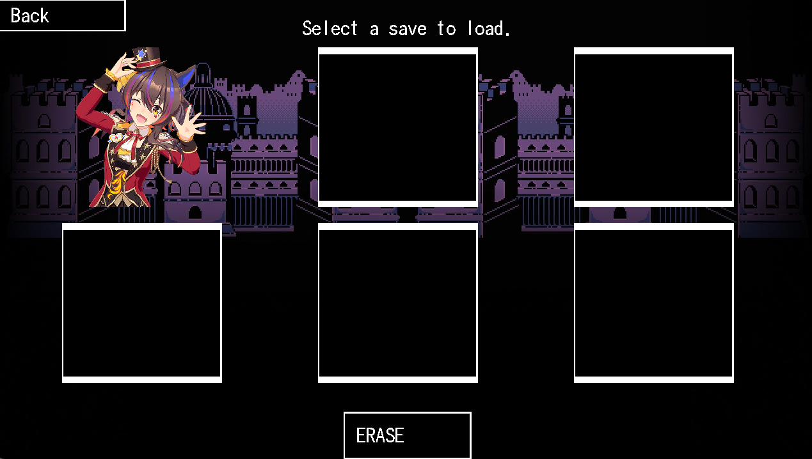
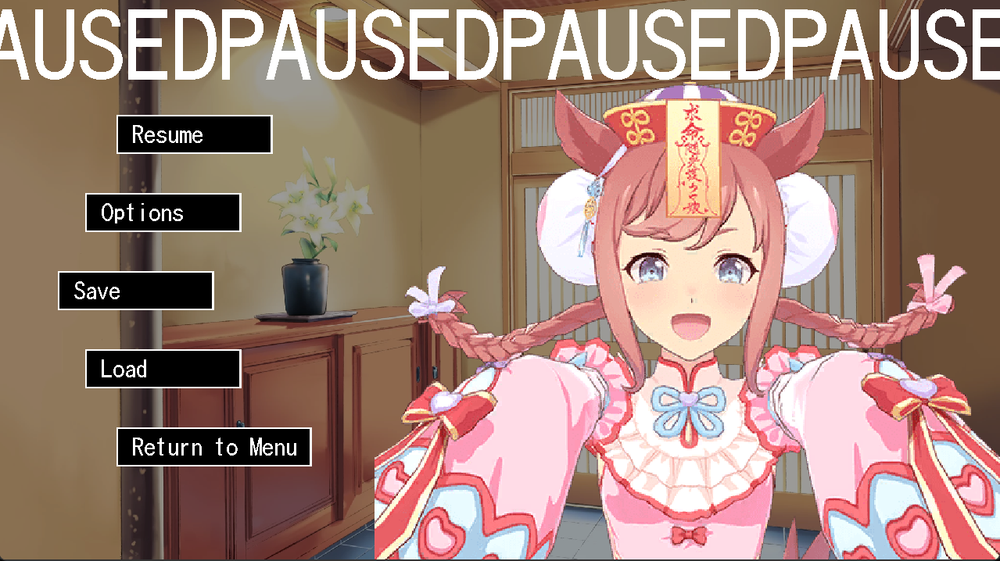

# SDLVN
## A Custom Visual Novel Engine For Non-Programmers


My goal with this engine is to make it easy for Non-Programmers to create visual novels, similar to something like Ren'Py

*But without ANY coding*
(ok, maybe a little scripting....)



I wish to achieve this through a custom scripting language that resembles, well, a script. I know I just said no programming and this is technically programming, but you get what im trying to say... (right?)

THIS PROJECT IS BAREBONES AT THE MOMENT (0.0.0.0.1v)

## TODO:
- Proper command handling
- Complete saving (doesn't save all text at the moment)
- Music/Sound effects (load from commands, play/pause, volume, etc)
- Multiple Resolutions including fullscreen/borderless (Need UI support)
- Basic animation (Fade In/Out, Transitions)
- Load/save preview
- cleaned up codebase


## Usage/Examples


```text
*enter saber saber.png CENTRE
*enter rin rin.png LEFT
*setsprite Saber angry_1
WHAT DO YOU THINK YOU'RE DOING!!!
```


Currently the engine supports basic text as well as player indicated replys and choices that can both be customised.

```text
Well I was just dropping by to say hello.
But I guess im not needed here!
Hmpg!
*reply "Geez, she's grumpy today..."
```


# Install/Use
Until I find a proper way to compile the game, you will have to simply clone the repo, you need to ensure you have **SDL2, SDL2 Image, SDL2 TTF and SDL2 Mixer** libs downloaded and point them to the project.

You also must ensure that you have a valid .vns file to point to as this is what runs the actual events for the engine, an exmaple_script.vns is provided.