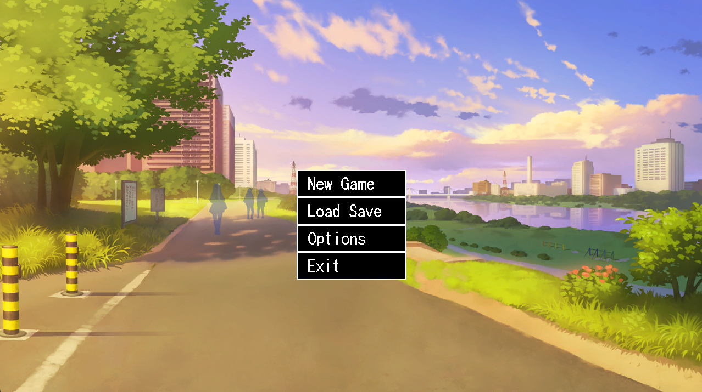
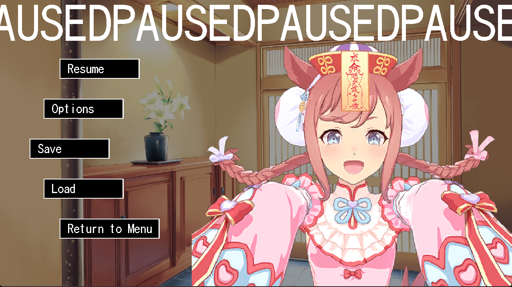
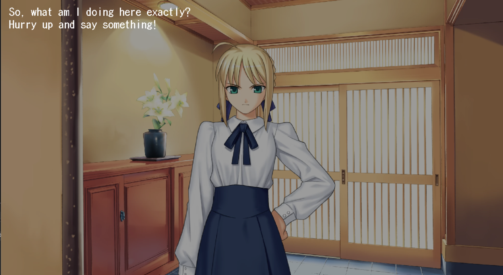
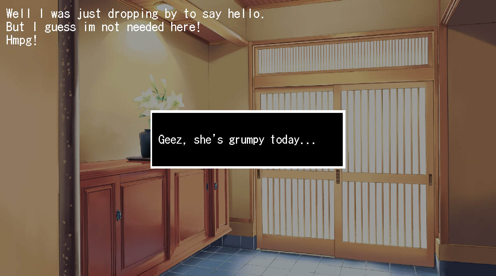

# SDLVN
## A Custom Visual Novel Engine For Non-Programmers


My goal with this engine is to make it easy for Non-Programmers to create visual novels, similar to something like Ren'Py

*But without ANY coding*
(ok, maybe a little scripting....)


I wish to achieve this through a custom scripting language that resembles, well, a script. I know I just said no programming and this is technically programming, but you get what im trying to say... (right?)

# Install/Use
This project makes use of CMake so make sure you have that installed.

1. Ensure you are in the root directory **SDLVN**
2. run cmake -S . -B build to generate a build folder (this may take several minutes)
3. Once this is complete, run cmake --build build to generate a debug build (cmake --build build --config Release) creates a release build with no terminal


THIS PROJECT IS BAREBONES AT THE MOMENT (0.0.0.0.1v)

## TODO:
- Music And SFX Volume Control
- Multiple Resolutions including fullscreen/borderless (Need UI support)
- Basic animation (Fade In/Out, Transitions)
- Load/save preview
- Options


## Usage/Examples


```text
*enter saber saber.png CENTRE
*enter rin rin.png LEFT
*setsprite Saber angry_1
WHAT DO YOU THINK YOU'RE DOING!!!
```



Currently the engine supports basic text as well as player indicated replys and choices that can both be customised.

```text
Well I was just dropping by to say hello.
But I guess im not needed here!
Hmpg!
*reply "Geez, she's grumpy today..."
```



