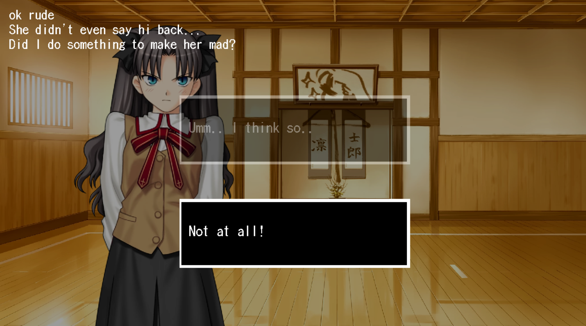

# SDLVN
## A Custom Visual Novel Engine For Non-Programmers
My goal with this engine is to make it easy for Non-Programmers to create visual novels, similar to something like Ren'Py

*But without ANY coding*


I wish to achieve this through a custom scripting language that resembles, well, a script. I know I just said no programming and this is technically programming, but you get what im trying to say... (right?)

THIS PROJECT IS BAREBONES AT THE MOMENT (0.0.0.0.1v)


## Usage/Examples

```text
*enter Saber saber
So, what am I doing here exactly?
*setsprite Saber angry_1
Hurry up and say something!
```


```text
*setsprite rin rin3.png
Did I do something to make her mad?
*choice 2 [yes] "Umm.. I think so.." [no] "Not at all!"
```


## TODO:
- Proper command handling
- ~~Proper sprite class and sprite ownership~~
- Solid engine foundation
- ~~Delay between commands~~
- ~~Proper command advancement~~
- ~~Actual choices like a proper visual novel~~
- ~~Animated text~~
- Animations (sprite and background)
- Menus (Main, Pause, Settings etc.)
